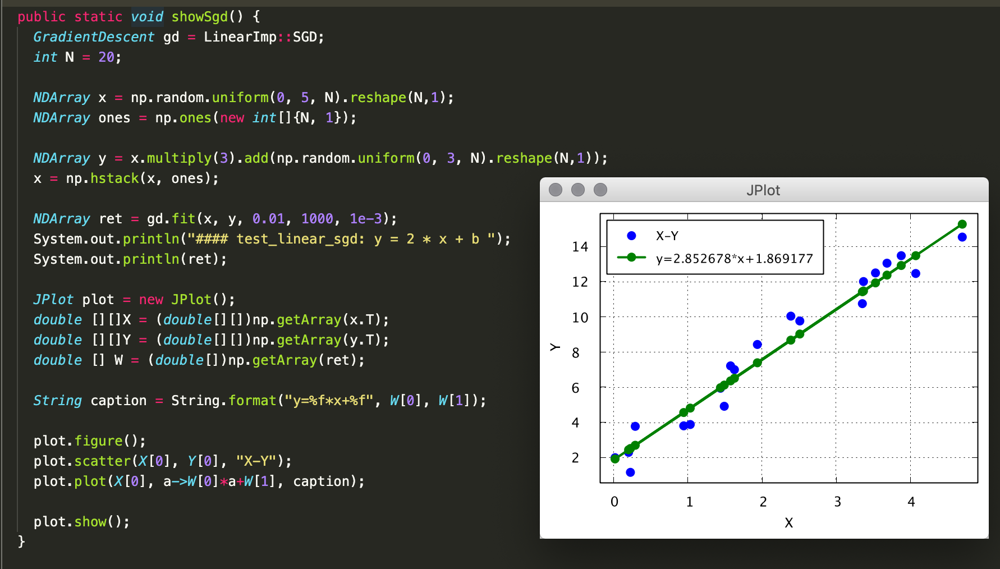
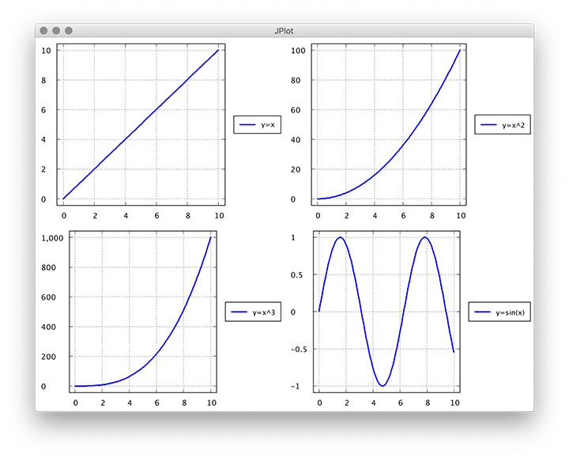

# jdeepro

#### 项目介绍(Introduction)
人工智能基础教程，使用Latex编写，基于Java实现。

The basics of artificial intelligence, written in Latex, based on Java.


jdeepro is a framework of deep learning tools and libraries written specially to take advantage of the Java™ Virtual Machine (JVM), written for the Java and Scala languages.


### 警告：刚好能够工作（Just work as expected.）
:) :) :)
Welcome to have a try!

#### Our Hope
1. Numpy参考实现 (Numpy reference impl)
2. Matplot参考实现 (Matplot reference impl)
3. AI基础算法实现 (AI basic algorithm impl)

#### 2019/11/17 梯度下降 （gradient descend）


``` java
GradientDescent gd = LinearImp::SGD;
int N = 20;

NDArray x = np.random.uniform(0, 5, N).reshape(N,1);
NDArray ones = np.ones(new int[]{N, 1});

NDArray y = x.multiply(3).add(np.random.uniform(0, 3, N).reshape(N,1));
x = np.hstack(x, ones);

NDArray ret = gd.fit(x, y, 0.01, 1000, 1e-3);
System.out.println("#### test_linear_sgd: y = 2 * x + b ");
System.out.println(ret);

JPlot plot = new JPlot();
double [][]X = (double[][])np.getArray(x.T);
double [][]Y = (double[][])np.getArray(y.T);
double [] W = (double[])np.getArray(ret);

String caption = String.format("y=%f*x+%f", W[0], W[1]);

plot.figure();
plot.scatter(X[0], Y[0], "X-Y");
plot.plot(X[0], a->W[0]*a+W[1], caption);

plot.show();
```

#### Easy to use
You can easily change python code to java, like this:
https://www.bilibili.com/video/av37947862?p=38
```java
public void test_xor() {
    class np extends Numpy{};
    int[][] dat_X = {{1,0,0},{1,0,1},{1,1,0},{1,1,1}};
    NDArray X = np.array(dat_X);

    int[] dat_Y = {0,1,1,0};
    NDArray Y = np.array(dat_Y).V();

    NDArray V = np.random.rand(new int[]{3,4}).multiply(2).subtract(1);
    NDArray W = np.random.rand(new int[]{4,1}).multiply(2).subtract(1);

    double learn_rate = 0.11;
    Activation sigmoid = new Sigmoid();
    NDArray L1 = null, L2 = null;

    for (int i = 0; i < 20000; i++) {
        L1 = sigmoid.active(np.dot(X, V));
        L2 = sigmoid.active(np.dot(L1, W));

        NDArray L2_delta = Y.T.subtract(L2).multiply(sigmoid.deactive(L2));
        NDArray L1_delta = L2_delta.dot(W.T).multiply(sigmoid.deactive(L1));

        NDArray W_change = L1.T.dot(L2_delta).multiply(learn_rate);
        NDArray V_change = X.T.dot(L1_delta).multiply(learn_rate);

        W = W.add(W_change);
        V = V.add(V_change);

        // Error: np.mean(np.abs(Y.T-L2)) -> decrese to 0
        // System.out.println(np.mean(np.abs(Y.T.subtract(L2))));
    }

    double[] expected = {0,1,1,0};
    assertTrue(L2.same(Numpy.array(expected).V().T, 0.1));
}
```

#### y = 3\*x1 + 4\*x2
```java
NDArray x1 = Numpy.linspace(0, 9, 10).V();
NDArray x2 = Numpy.linspace(4, 13, 10).V();
NDArray x = Numpy.concatenate(x1, x2);
System.out.println(x.T);

NDArray v = Numpy.array(new int[]{3, 4});
NDArray y = Numpy.dot(x.T, v.T);
double[] expected1 = {16.0, 23.0, 30.0, 37.0, 44.0, 51.0, 58.0, 65.0, 72.0, 79.0};
assertEquals(Numpy.array(expected1), y);

v = Numpy.array(new int[]{3, 4}).V();
y = Numpy.dot(x.T, v.T);
double[][] expected2 = {{16.0}, {23.0}, {30.0}, {37.0}, {44.0}, {51.0}, {58.0}, {65.0}, {72.0}, {79.0}};
assertEquals(Numpy.array(expected2), y);
```

#### 参与人员 Attendees
1. simbaba 2. jianyang 3. Tatsumi 4. xiaohui

#### 示例代码 Sample
与Python相关接口非常相近，从Python迁移到Java非常容易。
Similar to Python, you can quikly shift from Python to Java.

#### jshell中的运行效果(running result in jshell):


#### matplot的运行效果：


```java
JPlot plot = new JPlot();
double[] x = Range.arange(0, 10, 0.1);

Figure figure = plot.figure();
Axes axes = figure.add_subplot(2, 2, 1);
axes.plot(x, v->v, "y=x");

axes = figure.add_subplot(2, 2, 2);
axes.plot(x, v->v*v, "y=x^2");

axes = figure.add_subplot(2, 2, 3);
axes.plot(x, v->v*v*v, "y=x^3");

axes = figure.add_subplot(2, 2, 4);
axes.plot(x, v->Math.sin(v), "y=sin(x)");

plot.show();
```
Numpy算法实现，支持Vector和Matrix，接口与Numpy基本一致。
Easy to use, you can quickly learn how to integrate to your code.

```java
@Test
public void test_create() {
    int[] dat = {1,2,3,4,5,6,7,8};
    NDArray a = new NDArray(dat, 2,4);
    assertTrue(a.toString(), Arrays.equals((int[])a.data(), (int[])dat));
}

@Test
public void test_transpose() {
    NDArray a = Numpy.arange(36).reshape(4,3,3);
    int[] expected = {0, 9, 18, 27};
    int[][] range = {{0}, {0}};
    assertEquals(Numpy.array(expected), a.T.slice(range));
    System.out.println(a.T);

    a = Numpy.arange(12).reshape(4,3);
    int[] expected2 = {1, 4, 7};
    int[][] range2 = {{1}, {0,-1}}; // {{1}, {0, 3}}
    assertEquals(Numpy.array(expected2), a.T.slice(range2));
}

@Test
public void test_api_at() {
    NDArray a = Numpy.arange(12).reshape(3,4);
    int[] expected = {4,5,6,7};
    assertEquals(Numpy.array(expected), a.at(1));
    assertEquals(Numpy.array(6), a.at(1,2));
}

@Test
public void test_api_atRange() {
    NDArray a = Numpy.arange(36).reshape(4,3,3);
    int[] expected = {8, 17};
    int[][] range = {{0,2}, {2}, {-1+3}}; // not support negative, but slice can
    assertEquals(Numpy.array(expected), a.atRange(range));
}

@Test
public void test_shape() {
    int[] dat = new int[]{2,4};
    NDArray a = Numpy.array(dat);
    assertEquals("(2,)", a.shape());
}

@Test
public void test_slice() {
    NDArray a = Numpy.arange(12).reshape(3,4);
    int[][] range1 = {{1, 3}, {-1}};
    NDArray b = a.slice(range1);
    assertEquals("array([7, 11])\n", b.toString());

    int[][] range2 = {{ALL}, {-2}};
    b = a.slice(range2);
    assertEquals("array([2, 6, 10])\n", b.toString());

    int[][] range3 = {{-2, -1}, {-2}};
    b = a.slice(range3);
    assertEquals("array([6])\n", b.toString());

    int[][] range4 = {{-1}, {-2}};
    b = a.slice(range4);
    assertEquals("10", b.toString());
}

@Test
public void test_broadcast() {
    NDArray a = Numpy.arange(12).reshape(3,4);
    NDArray b = Numpy.add(a, 2);

    assertEquals("array([[2 , 3 , 4 , 5 ]\n" +
        "       [6 , 7 , 8 , 9 ]\n" +
                "       [10, 11, 12, 13]])\n", b.toString());

    b = Numpy.sub(b, 2);
    assertEquals("array([[0 , 1 , 2 , 3 ]\n" +
                "       [4 , 5 , 6 , 7 ]\n" +
                "       [8 , 9 , 10, 11]])\n", b.toString());

    int[] dat = {10, 20, 30, 40};
    NDArray c = Numpy.add(a, dat);

    assertEquals("array([[10, 21, 32, 43]\n" +
        "       [14, 25, 36, 47]\n" +
                "       [18, 29, 40, 51]])\n", c.toString());
}

@Test
public void test_arange() {
    NDArray a = Numpy.arange(12).reshape(3,4);
    assertEquals("(3, 4)", a.shape());
}

@Test
public void test_random() {
    NDArray a = Numpy.random.rand(4,4);
    System.out.println(a);
    assertEquals("(4, 4)", a.shape());
}

@Test
public void test_ndarray_add() {
    NDArray a = Numpy.ones(3,4);
    NDArray b = Numpy.zeros(3,4);
    NDArray c = Numpy.add(a, b);
    System.out.println(c);
}

@Test
public void test_ndarray_dot() {
    NDArray a = Numpy.arange(12).reshape(3,4);
    NDArray b = Numpy.arange(16).reshape(4,4);
    NDArray c = Numpy.dot(a, b);

    assertEquals(
        "array([[56 , 62 , 68 , 74 ]\n"+
        "       [152, 174, 196, 218]\n"+
        "       [248, 286, 324, 362]])\n", c.toString());

    NDArray d = Numpy.arange(12).reshape(3,4);
    NDArray e = Numpy.dot(d, 2);
    assertEquals(e, Numpy.add(d, d));

    d = Numpy.arange(12).reshape(3,4);
    e = Numpy.array(2);
    assertEquals(Numpy.dot(d, 2), Numpy.dot(d, e));

    d = Numpy.arange(12).reshape(3, 4);
    e = Numpy.array(new int[]{1, 2, 3, 4});
    assertEquals(Numpy.array(new int[]{20, 60, 100}), Numpy.dot(d, e));
}

@Test
public void test_struct() {
    NDArray a = Numpy.arange(24).reshape(2,3,4);
    int[][][] array = (int[][][])Numpy.getArray(a);
    
    int[][][] real = new int[][][]{
        {{0, 1, 2, 3}, {4, 5, 6, 7}, {8, 9, 10, 11}}, 
        {{0, 1, 2, 3}, {4, 5, 6, 7}, {8, 9, 10, 11}}
    };
    
    assertEquals("3 dimens int[][][] array", Arrays.deepToString(array), Arrays.deepToString(real));
}
```
